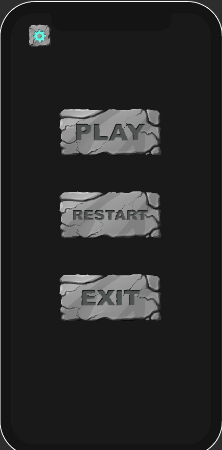
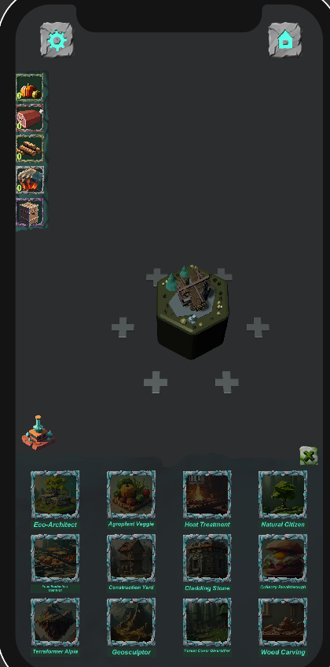
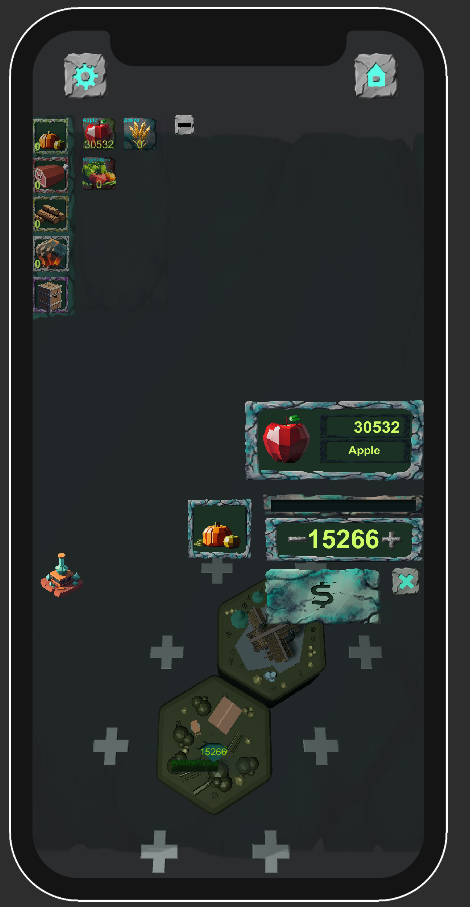
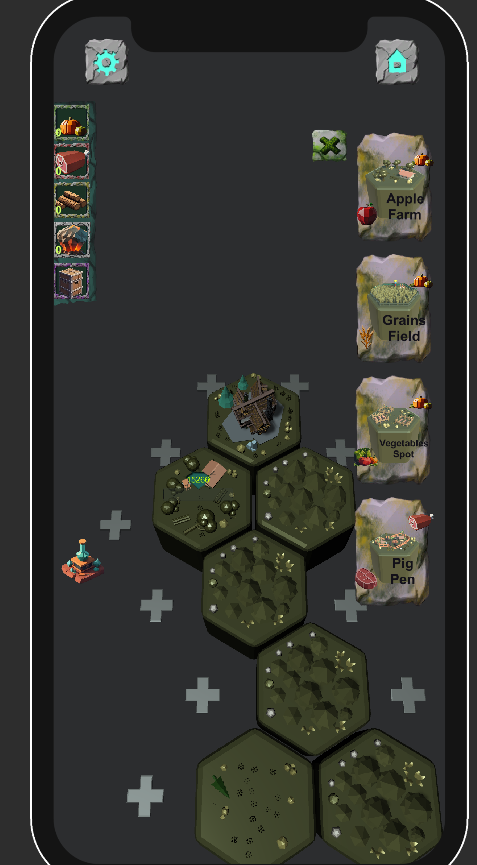
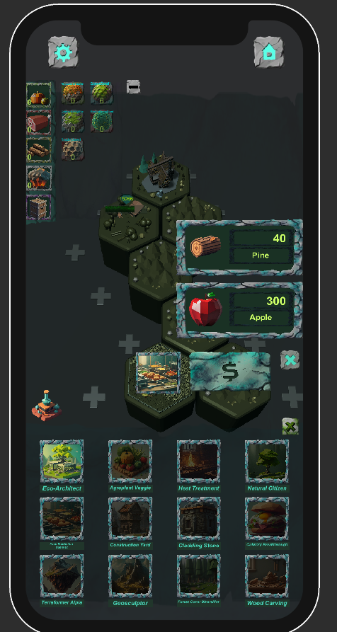

# Feodal
Tycoon Game
=======
<!DOCTYPE html>
<html lang="en">
<head>
    <meta charset="UTF-8">
    <meta name="viewport" content="width=device-width, initial-scale=1.0">
    <title>Idle Tycoon Game by Yummaddo</title>
    
</head>
<body>
    <h1>Idle Tycoon Game by Yummaddo</h1>
    
License: MIT

    
Build Status: Successful

    
Version: 1.0.0

    <h2>Description</h2>
    
An engaging idle tycoon game developed for Android using Unity by Yummaddo. Build and manage your empire, optimize resources, and become the ultimate tycoon!

    <h2>Contents</h2>
    <ul>
        <li><a href="#features">Features</a></li>
        <li><a href="#installation">Installation</a></li>
        <li><a href="#usage">Usage</a></li>
        <li><a href="#examples">Examples</a></li>
        <li><a href="#contributing">Contributing</a></li>
        <li><a href="#license">License</a></li>
        <li><a href="#contact">Contact</a></li>
    </ul>
    <h2 id="features">Features</h2>
    <ul>
        <li>Automated resource management</li>
        <li>Progression and upgrades</li>
        <li>In-game achievements</li>
        <li>Beautifully crafted 3D graphics</li>
        <li>Intuitive user interface</li>
    </ul>
    <h2 id="installation">Installation</h2>
    <h3>Requirements</h3>
    <ul>
        <li>Android device with version 5.0 or above</li>
        <li>Internet connection for updates and online features</li>
    </ul>
    <h3>Steps to Install</h3>
    <pre>
        <code>
# Clone the repository
git clone https://github.com/yummaddo/Feodal
# Navigate to the project directory
cd idle-tycoon-game
# Open the project in Unity
# (Ensure you have the correct version of Unity installed)
        </code>
    </pre>
    <h2 id="usage">Usage</h2>
    
Instructions on how to play the game and make the most out of its features.

    <pre>
        <code>
# Run the game from Unity editor or build it for Android
# Follow the in-game tutorial to get started
        </code>
    </pre>
    <h2 id="examples">Examples</h2>
    
Gallery of screenshots showcasing the game's interface and features:

    

        
        
        
        
        
    

    <h2 id="contributing">Contributing</h2>
    
Guidelines for contributing to the project.

    <ol>
        <li>Fork this repository</li>
        <li>Create your branch (<code>git checkout -b feature/feature-name</code>)</li>
        <li>Commit your changes (<code>git commit -m 'Add new feature'</code>)</li>
        <li>Push to the branch (<code>git push origin feature/feature-name</code>)</li>
        <li>Open a Pull Request</li>
    </ol>
    <h2 id="license">License</h2>
    
This project is licensed under the MIT License. See the <a href="LICENSE">LICENSE</a> file for details.

    <h2 id="contact">Contact</h2>
    
If you have any questions or suggestions, feel free to contact us:

    <ul>
        <li>Email: <a href="mailto:bhj010fert14@gmail.com">bhj010fert14@gmail.com</a></li>
        <li>LinkedIn: <a href="www.linkedin.com/in/voytusik-ivan-609aaa281">Yummaddo</a></li>
        <li>GitHub: <a href="https://github.com/yummaddo">Yummaddo</a></li>
    </ul>
</body>
</html>
